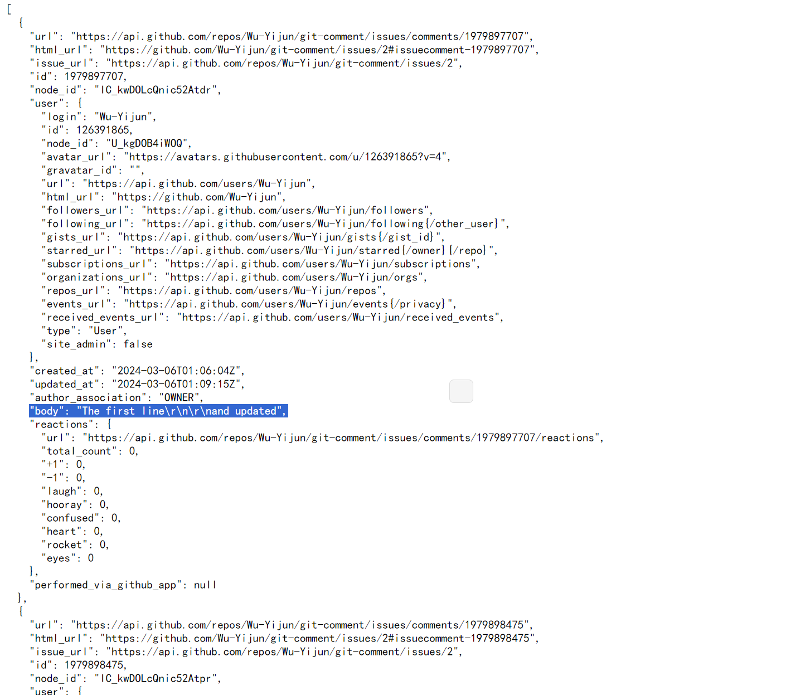
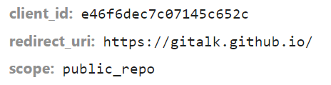
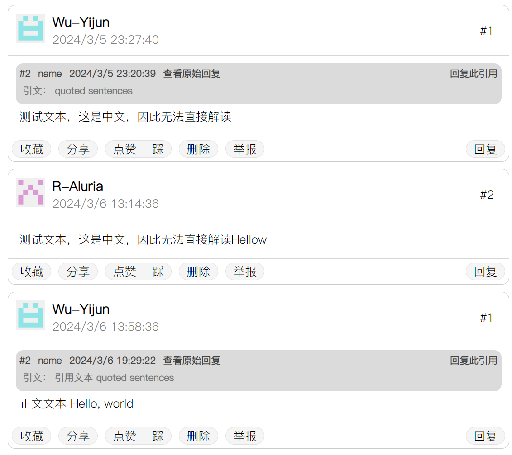
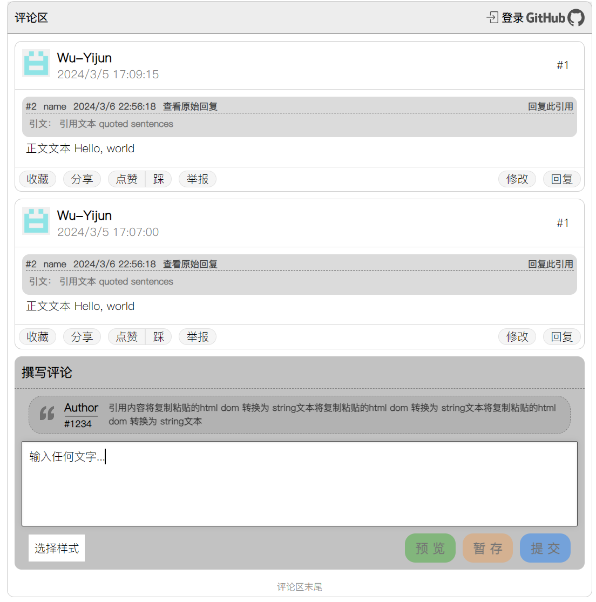
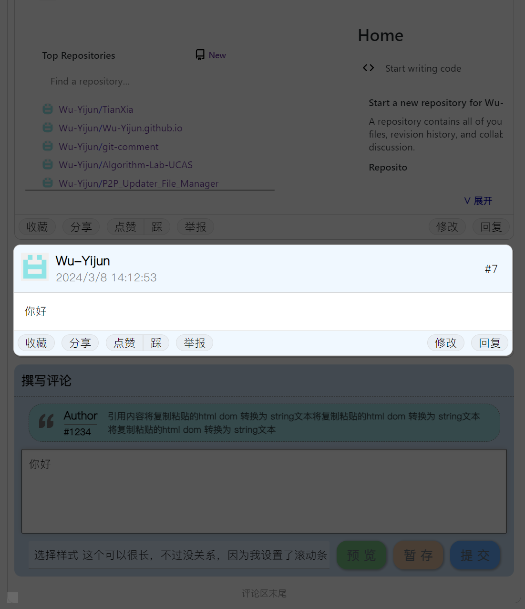
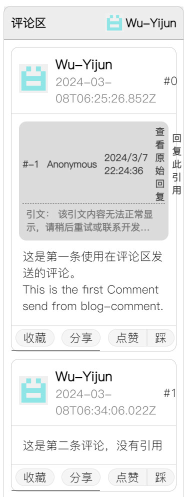

# git-comment
在静态页面中利用 github 的 issues 功能形成评论区

# 🚧 WORK IN PROGRESS

### 进度

未完成

我准备在个人主页加入一个评论区的功能，但是由于我没有自己的服务器，因此只能依托于github的issue功能，将在issue下方的评论转变为blog中的评论。

### 要点

第一，为保证各方面安全，blog中保存的为字符串信息，在 github 中储存为 encodeURIComponent 编码，保证不会失真
第二，使用 Oauth 登录github账户以发表issue
第三，不需要登录即可查看评论。
第四，切换排序方式，包括按时间/引用次数/点赞次数/举报次数/用户活跃度进行升序/降序排列，且允许筛选（屏蔽，范围等）

### 进展

现在已经完成了一个评论条目的基本框架，可以自行管理条目。

接下来读取和更新 github issues.

#### 读取

这是比较简单的，下面两个请求即可获取到对应的数据 `https://api.github.com/repos/Wu-Yijun/git-comment/issues/2` 获取标题和题头内容，而其中的具体每一条回复在 `https://api.github.com/repos/Wu-Yijun/git-comment/issues/2/comments?per_page=10&page=1` 下可见。

考虑到github issue只能本人修改，因此不能在开头存储索引。方便部分下载以节约资源。

先尝试从 `https://api.github.com/repos/Wu-Yijun/git-comment/issues/2/comments` 中提取单纯的文本信息。

大致的结构如下

存储在body结构体里。

然后对它进行分析处理，最终完成了从gitissues 上读取评论的功能。

#### 登录 Oauth

从 `gittalk` 的登录处抓取到的请求为：`https://github.com/login/oauth/authorize?client_id=e46f6dec7c07145c652c&redirect_uri=https%3A%2F%2Fgitalk.github.io%2F&scope=public_repo` 解析后为

登录完成之后的重定向为：`https://gitalk.github.io/?code=534836be7e0bc8eb7e9f`

我们发现，多了一个 code ，这也就是 github 返回的授权码。

我们将`client_id`,`client_secret`,`code`三个查询集成到链接 `https://github.com/login/oauth/access_token` 下，用post请求可以获得一个github返回的access_token。

但是，由于github的跨域限制，导致我们不能将client_secret明文集成到js代码中（出于有安全性考虑）。因此我们需要通过代理转发请求。
我们的方法来自下面的文章 [Github Oauth Login – Browser-Side](https://blog.vjeux.com/2012/javascript/github-oauth-login-browser-side.html "Github Oauth 登录 – 浏览器端")
如果有php服务器，那么是可以运行的，但是，github pages 是静态页面，不能允许php。因此我抛弃了这种方法。

最终，我选择通过 https://cors-anywhere.herokuapp.com/ 临时代理跨域请求。我希望能找到一个轻量级的免费的服务器来代理我的请求。

#### 获取数据

这一步比较简单，关键点就是将认证信息`xmlHttp.setRequestHeader("Authorization", "token " + access_token);`加入到头内。

#### 发送评论

起初，我使用了 **Octokit** 的集成工具，但是考虑到体量，以及 Octokit 也不能完成oauth认证的缺陷，我决定完全弃用它。

接着，我们参考了 **gitalk** 的POST方法，然后利用跨域代理 `https://cors-anywhere.azm.workers.dev/` 来完成认证过程中受限制的POST请求。

### 整合到评论区... 

目前已经完成了一个基本的 commentManager 工具，可以从github的issue转化为合适的评论进行显示。

我们需要进一步将此评论化为带有登录，回复功能的评论区。

#### 评论区回复功能

在写回复功能时，我发现了一个有意思的事情，`div`可以有一个可编辑选项，用于替代`textarea`，是非常好用的。

我们调好了样式，接着就是关于html或纯文本样式的选择关系问题（这个我们之后再搞，现在先不管）
目前已经实现了回复框自动缩放等功能

然后我又发现一个属性

可以直接将div转为textarea，并且更好用，支持标签。

最终的结果如下

#### 加入js功能

下一步将之前写好的git登录访问等功能整合完成，就可以直接集成到blog下了。

现在完成了登录和登出功能，也就是说，用户信息已经ok了。

接着就利用这些用户信息完成发表评论的功能吧！

发表评论很简单，有了登录信息后，直接post一下就可以了。因为发表前需要先确定此条评论的 id ，因此我们需要先请求git返回总comment数量，以此来确认id。这是一个需要异步完成的工作，因此我们在`commentManager`类中加入了一个异步的`async getCommentNum()` 它会去调用 `GitControl.asynGetCommentNum()` 将 Promise 对象变为 asyn 函数。

确定了id之后，我们就可以将信息填完整，放入 json 中，转string为uri数据，然后发送到issues上去。

#### 进一步完善

除了提交之外，我还完成了暂存功能。

这个很简单，就是保存到localStorage中，以 `CommentTextareaCache[id]at<pathname>` 命名的项目对应着每一个独特的评论框。id是考虑到一个页面上可能有多个评论区，因此每一个输入框都会对应唯一的独特的id。
然后pathname对应着当前的页面路径，这也可以保证每一个页面都是唯一的。

**预览功能** 需要我们新建一个comment-entry，用div包裹起来，div充满全屏，半透明黑色，点击鼠标就会隐藏。
显示的方法类似发表评论，这次不必要请求git，直接使用保存的commentsNum(可能有错，但无所谓)。因为我们写过了setDomComment函数，只需要将dom替换为这个特殊的comment-entry，将根据下方评论和用户信息新建一个comment即可。

目前的预览效果如下

### 其它小细节

又修复了一些小细节，包括：

页面可能会因为评论内容中的 `position: absolute` 产生不必要的滚动，目前我还没有找到好的解决方案，目前的临时替代方案是用 `body {overflow-x: hidden; }` 来消除页面横向滚动。

**滚动条**除了页面的主滚动条外，其余的滚动条都被我改成了较细的样式，这样比较好看。

**按钮布局**在页面非常窄的时候，会出现点赞/踩按钮上下排列，已经修复，然后字会变成两行，也修复了。我在comment-entry的下方功能按钮加了滚动条功能，如果过窄会自动出现。

不过可以看出还是有一些问题的，比如引用区域的格式等等。

**时间显示**时间显示很不友好，我在想是改成本地时间，还是简单显示1小时前这种。后者较复杂，我先改成前面一种 `new Date(comment.date).toLocaleString()`。

**发表后更新评论区**只是单纯的多添加了一行罢了，使用的是git返回的数据。

**添加了ctrl+enter发送功能**

**将链接hash配置好了** 这样

### 将项目打包

首先，需要先将在外部（main.mjs）中的代码尽量移出，尤其是请求资源的。但是我还是保留了两个，都是请求页面布局的，我不想把这个也一起移出去了。